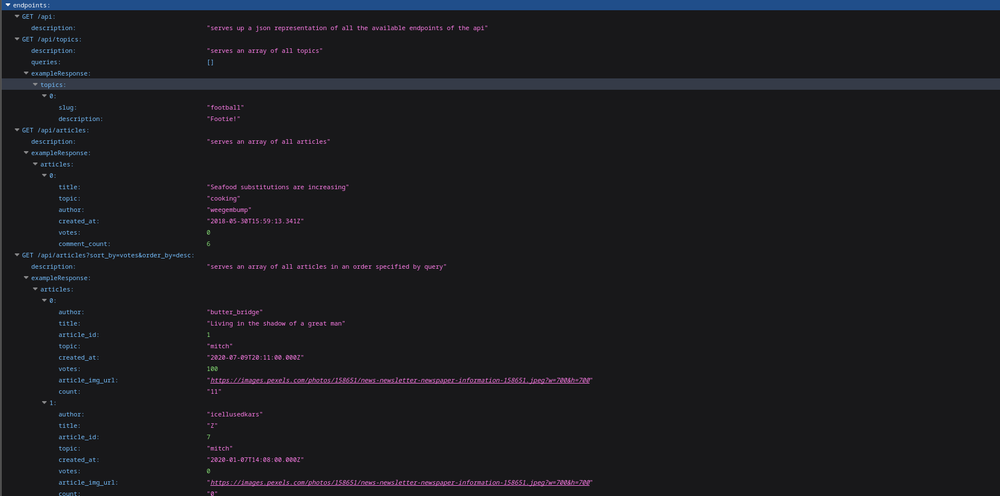

Northcoders News API

This API gives you access to all relevant articles from the Northcoders news service. It enables you to filter the information depending on your needs.

The api is at this link: https://news-api-h2gt.onrender.com/api

Use git clone on https://github.com/uzougochukwu/seed-info

Then in the main folder of the repo, run
npm install
npm install pg
npm install supertest

npm install jest
npm install jest-sorted

Then at the bottom of the package.json file change
"jest": {
"setupFilesAfterEnv": [
"jest-extended/all"
]

to

"jest": {
"setupFilesAfterEnv": [
"jest-extended/all", "jest-sorted"
]

Then run

npm run setup-dbs
npm run seed-dev
npm run test-seed
npm run seed-prod

To run tests use

npm test

Go to the main folder of your repo
Create the .env.test file.
In this file write PGDATABASE=nc_news_test

Create the .env.development file
In this file write PGDATABASE=nc_news

The minimum version of Node.js needed is v23.8.0
The minimum version of Postgres needed is 16.8

